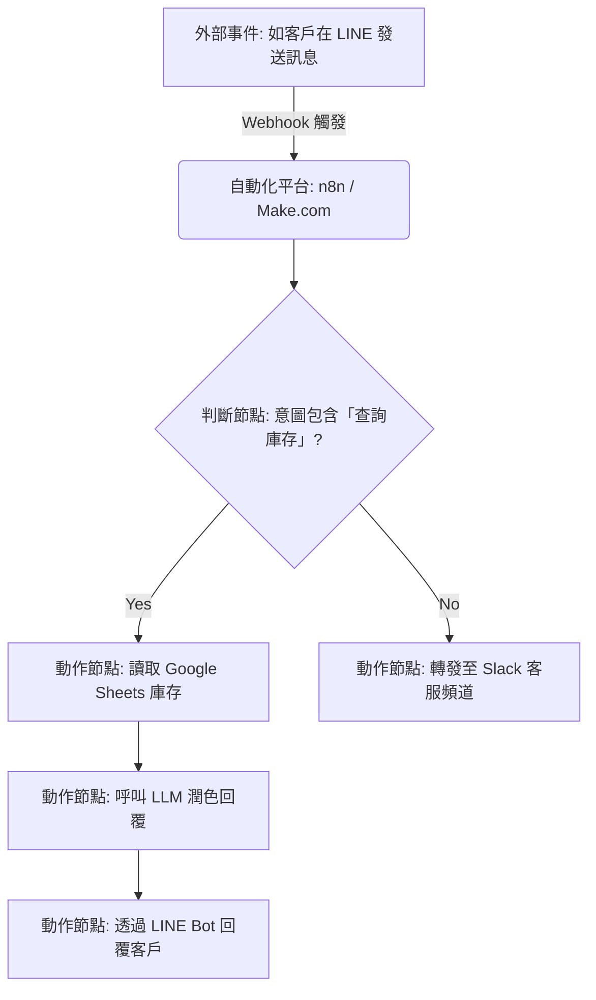
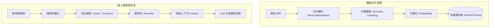
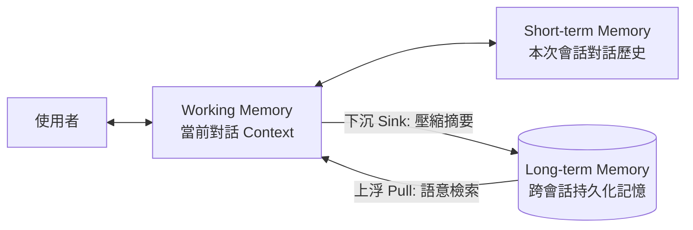
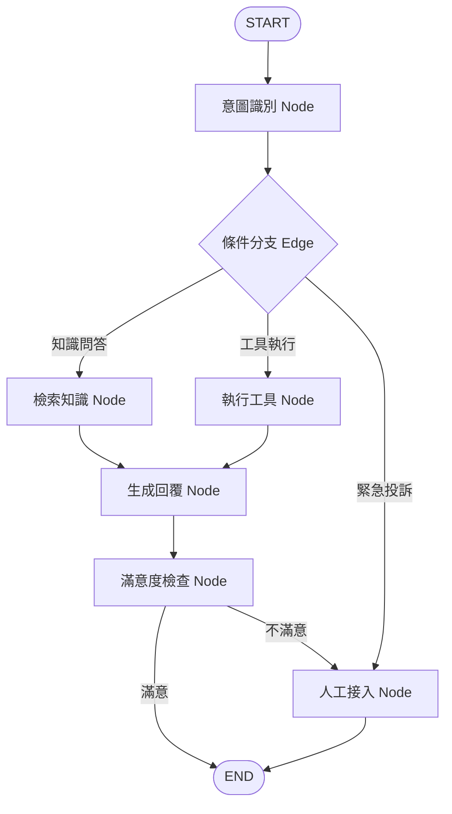
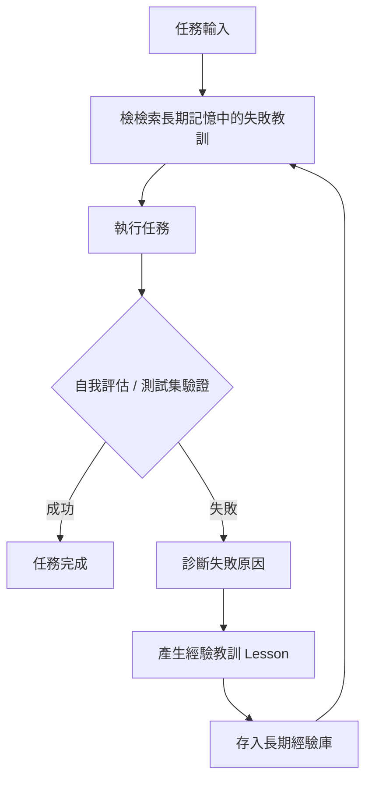
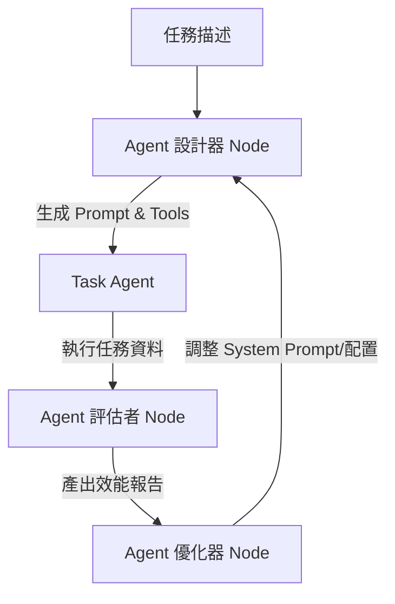
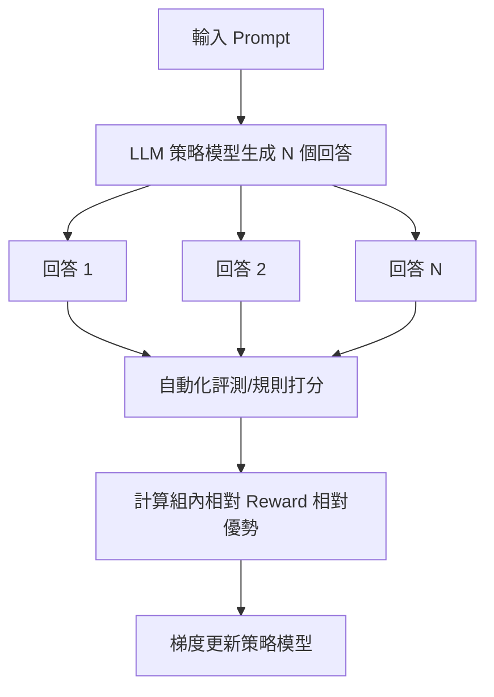

# 🤖 AI Agent 從入門到進階 — 學習路線圖

> **目標人羣**：對 AI Agent 有基本瞭解，知道 ChatGPT/Claude/Coze 是什麼，但面對「如何自己做一個 Agent」「如何深入 Agent 開發」時不知從何下手的人。
>
> **設計哲學**：每一階段都包含 **「學什麼 → 練什麼 → 用什麼工具 → 產出什麼」** 四個環節，確保每一步都有可驗證的成果。
>
> 📐 **配套等級制度**：本路線圖對應 [AI Lab 7 階段成長等級制度](./AI-Lab-成長等級制度.md)，每個 Phase 完成後可獲得相應等級認證。

---

## AI Lab 等級快速對照

| Roadmap Phase | 對應 AI Lab 等級 | 一句話定位 |
|---|---|---|
| Phase 0 | Stage 0 — AI 新手村 | 消除恐懼，建立人機協作思維 |
| Phase 1 | Stage 1 — AI 探索者 | 把 LLM 用成頂級特助 |
| Phase 2 | Stage 2 — AI 實踐者 | 用 AI 快速做出能看的原型 |
| Phase 3 | Stage 3 — 初階 AI 建造者 | 交付能存檔、能運作的真實系統 |
| Phase 4 | Stage 4 — 流程自動化專家 | 打破軟體孤島，打造全自動流程 |
| Phase 5 | Stage 5 — 高階 AI 架構師 | 打造能自主決策的 Agent 系統 (分代碼軌/低代碼軌) |
| Phase 6 | Stage 6 — 自我進化 Agent 架構師 🆕 | 設計能自我改進的元 Agent (分代碼軌/低代碼軌) |

> 💡 **詳細等級定義、通過標準、升階條件** → 見 [AI-Lab-成長等級制度.md](./AI-Lab-成長等級制度.md)

---

## 目錄

- [快速自測：你現在在哪個階段？](#快速自測你現在在哪個階段)
- [Phase 0：前置知識補漏（1-2 天）](#phase-0前置知識補漏1-2-天)
- [Phase 1：Agent 核心心智（1 周）](#phase-1agent-核心心智1-周)
- [Phase 2：低代碼實戰 — 先做出來再理解（2 周）](#phase-2低代碼實戰--先做出來再理解2-周)
- [Phase 3：代碼級 Agent — 打開黑盒（3-4 周）](#phase-3代碼級-agent--打開黑盒3-4-周)
- [Phase 4：流程自動化專家 — 打破軟體孤島（2-3 周）](#phase-4流程自動化專家--打破軟體孤島2-3-周)
- [Phase 5：生產級 & 高階 Agent 架構 — RAG, Memory, LangGraph（3-4 周）](#phase-5生產級--高階-agent-架構--rag-memory-langgraph3-4-周)
- [Phase 6：自我進化 Agent 架構師 — DSPy, Meta-Agent, RL（6-8 周）](#phase-6自我進化-agent-架構師--dspy-meta-agent-rl6-8-周)
- [學習資源彙總](#-學習資源彙總)
- [常見誤區 & 避坑指南](#-常見誤區--避坑指南)

---

## 快速自測：你現在在哪個階段？

| 你能否做到？ | 如果不能 → 從 Phase 開始 |
|---|---|
| 理解 LLM 的基本原理（Token、上下文窗口、Temperature） | Phase 0 |
| 能手寫一個有效的 System Prompt 讓 AI 按你的意圖輸出 | Phase 0 |
| 在 Coze/Dify 上搭建過一個完整的 Agent Workflow | Phase 2 |
| 用 Python + LangChain 寫過 Agent（含 Tool Calling） | Phase 3 |
| 搭建過跨多個 SaaS 工具的自動化流程 (Make.com/n8n) | Phase 4 |
| 設計並實現過包含 RAG + Memory 的有狀態 Agent 工作流 (LangGraph) | Phase 5 |
| 理解並寫過 MCP Server / 部署過生產級監控服務 | Phase 5 |
| 寫過能自我評估與修正的 Reflexion/DSPy 代理或 RL 微調模型 | Phase 6 |

---

## Phase 0：前置知識補漏（1-2 天）

> **目標**：確保你對 LLM 有正確的底層認知，而不是停留在「ChatGPT 很厲害」的表面。

### 學什麼

| 知識點 | 核心問題 | 推薦資源 |
|---|---|---|
| LLM 本質 | 大模型到底是什麼？爲什麼它能"理解"語言？ | [3Blue1Brown 神經網絡](https://www.3blue1brown.com/topics/neural-networks) |
| Token & Tokenizer | 爲什麼中文比英文貴？Token 是怎麼計算的？ | [OpenAI Tokenizer](https://platform.openai.com/tokenizer) |
| Context Window | 上下文窗口是什麼？爲什麼說它是最稀缺的資源？ | [Anthropic Context Windows 指南](https://docs.anthropic.com/en/docs/build-with-claude/context-windows) |
| Temperature & Top-P | 如何控制模型輸出的「創造力」？ | OpenAI/Anthropic 官方文檔 |
| 主流模型對比 | GPT / Claude / Gemini / DeepSeek / Qwen 各自擅長什麼？ | [LMSYS Chatbot Arena](https://chat.lmsys.org/) |

### 練什麼

- [ ] 在 [OpenAI Playground](https://platform.openai.com/playground) 中調整 Temperature 從 0 到 2，觀察同一 Prompt 的輸出差異
- [ ] 用同一個問題測試 GPT-4o / Claude / DeepSeek，寫出對比筆記
- [ ] 計算一段 1000 字中文文本大概消耗多少 Token

### 產出

✅ 一份 **「我的 AI 基礎認知筆記」**（至少包含：LLM 本質理解、模型對比表、Token 計算例子）

---

## Phase 1：Agent 核心心智（1 周）

> **目標**：深刻理解「Agent ≠ Chatbot」的核心差異，掌握 Agent 的思維框架。
>
> **爲什麼這個階段重要**：很多人卡住是因爲把 Agent 當成"更聰明的聊天機器人"——大錯特錯。Agent 的核心是 **自主決策 + 工具使用 + 任務規劃**。

### 學什麼

#### 1.1 Agent 的定義與核心循環

```
┌────────────────────────────────────────────────────────────────────┐
│         Agent 核心循環                                              │
│                                                                    │
│  感知(Perceive) → 思考(Think) → 行動(Act) → 觀察(Observe) → 循環...  │
│                                                                    │
└────────────────────────────────────────────────────────────────────┘
```

- **Perceive**：獲取環境信息（用戶輸入、工具返回、上下文）
- **Think**：LLM 推理，決定下一步做什麼
- **Act**：調用工具、生成回覆、執行代碼
- **Observe**：獲取行動結果，判斷是否達成目標

#### 1.2 Prompt Engineering for Agents

> 這不是普通的 Prompt Engineering——這是 Agent 的系統指令設計。

| 關鍵元素 | 說明 | 示例 |
|---|---|---|
| Role & Persona | 定義 Agent 的身份和能力邊界 | "你是一個數據分析專家..." |
| Task Definition | 明確的任務目標 | "你需要分析用戶上傳的 CSV 文件..." |
| Tool Descriptions | 告訴模型有哪些工具可用 | "你有以下工具：search_web, run_python, read_file" |
| Constraints & Rules | 行爲約束 | "不要編造數據。如果沒有找到答案，誠實告知。" |
| Output Format | 期望的輸出格式 | "最終回覆使用 Markdown 表格呈現" |

#### 1.3 Function Calling / Tool Use

這是 Agent 和 Chatbot 最大的分水嶺——**Agent 會調用工具**。

**完整流程**：
```
用戶提問 → LLM 判斷需要用哪個工具 → 返回 function_call → 
你的代碼執行這個函數 → 將結果傳回 LLM → LLM 基於結果生成最終回覆
```

### 練什麼

- [ ] 設計一個 Agent 的 System Prompt（角色：旅行規劃助手），包含至少 3 個工具描述
- [ ] 用 curl 或 Python 調用 OpenAI/Anthropic API 的 Function Calling，觀察返回的 `tool_calls`
- [ ] 寫一個小腳本：讓 LLM 決定"現在幾點"時自動調用 `get_current_time()` 函數

### 產出

✅ 一份 **Agent System Prompt 模板** + 一個 **Function Calling 的 Python Demo**

---

## Phase 2：低代碼實戰 — 先做出來再理解（2 周）

> **目標**：在 Coze/Dify 上構建 2-3 個可用的 Agent，建立「我能做出來」的信心。
>
> **爲什麼選低代碼**：直接上手 LangChain 容易迷失在 API 細節裏。先用低代碼平臺理解 Agent 的「感覺」，再回頭寫代碼才能知道自己在做什麼。

### 學什麼

| 平臺 | 定位 | 何時使用 |
|---|---|---|
| [**Coze (釦子)**](https://www.coze.com/) | 字節跳動出品，插件生態豐富 | 快速搭建 + 發佈到飛書/微信 |
| [**Dify**](https://dify.ai/) | 開源，可私有部署，企業級 | 需要私有化部署 + 複雜 Workflow |

**核心概念映射**（低代碼 → 代碼）：
| 低代碼概念 | 對應代碼層概念 |
|---|---|
| Plugin / 插件 | Tool / Function |
| Knowledge / 知識庫 | RAG 的 Indexing + Retrieval |
| Workflow / 工作流 | LangGraph StateGraph |
| Variable / 變量 | State |
| Node / 節點 | LangChain Runnable |

### 練什麼（按順序）

- [ ] **項目 1**：Coze 上搭建一個 **「AI 日報生成器」**
  - 輸入：用戶感興趣的主題
  - 工具：搜索插件 + 大模型
  - 輸出：格式化的日報 Markdown
  - 發佈到飛書 Bot

- [ ] **項目 2**：Dify 上搭建一個 **「智能客服 Agent」**
  - 知識庫：上傳 3-5 份產品文檔
  - 工作流：意圖識別 → 知識檢索 → 答案生成 → 無法回答時轉人工
  - 變量：記錄對話歷史，支持追問

- [ ] **項目 3（選做）**：搭建一個多步驟 Workflow
  - 場景：用戶輸入「幫我分析 XX 公司財報」
  - 步驟：搜索最新財報 → 提取關鍵指標 → 對比行業均值 → 生成分析報告

### 產出

✅ 至少 2 個**可演示的 Agent Bot** + 一份 **「低代碼 vs 代碼開發」對比筆記**

---

## Phase 3：代碼級 Agent — 打開黑盒（3-4 周）

> **目標**：用 Python + LangChain/LangGraph 從零構建 Agent，徹底理解 Agent 內部工作原理。
>
> **這是最關鍵的分水嶺**——過了這個階段，你就是能寫 Agent 的人了。

### 學什麼

#### 3.1 LangChain 核心概念

| 概念 | 一句話解釋 | 
|---|---|
| **Chain** | 把多個步驟串聯起來（A → B → C） |
| **Tool** | 封裝一個能被 Agent 調用的函數 |
| **AgentExecutor** | Agent 的運行時：不斷執行「思考→調用工具→觀察」循環 |
| **Memory** | 讓 Agent 記住之前的對話 |
| **Runnable / LCEL** | LangChain 的聲明式編程接口（`prompt \| llm \| parser`） |
| **Callback** | 在 Agent 運行的每個節點插入自定義邏輯（日誌、監控） |

#### 3.2 用 create_agent 快速起步

```python
# 最簡 Agent — 10 行代碼
from langchain.agents import create_agent

agent = create_agent(
    model="claude-sonnet-4-5-20250929",
    tools=[search_tool, calculator_tool, weather_tool],
    system_prompt="你是一個有用的助手，可以搜索信息、計算數學、查詢天氣。"
)

result = agent.invoke({"messages": [{"role": "user", "content": "北京今天天氣怎麼樣？"}]})
```

#### 3.3 自定義 Tool

```python
from langchain.tools import tool

@tool
def get_stock_price(symbol: str) -> str:
    """獲取指定股票的最新價格。symbol 參數爲股票代碼，如 AAPL、TSLA。"""
    # 實際實現中調用 API
    price = api.get_price(symbol)
    return f"{symbol} 最新價格：${price}"

# Tool description 至關重要！LLM 靠 description 決定是否調用這個工具
```

**Tool Description 最佳實踐**：
- ✅ 明確描述功能和參數
- ✅ 給出參數示例
- ✅ 說明返回格式
- ❌ 不要寫"這個工具可以做任何事情"

#### 3.4 Agent 的四種類型

| 類型 | 工作機制 | 適用場景 |
|---|---|---|
| **ReAct** | Think → Act → Observe 循環 | 通用推理 + 行動 |
| **Plan-and-Execute** | 先規劃再執行 | 複雜多步驟任務 |
| **OpenAI Functions** | 依賴 OpenAI 原生 Function Calling | 簡單直白的工具調用 |
| **Structured Chat** | 支持多參數複雜工具調用 | 需要結構化的輸入輸出 |

### 練什麼（按難度遞增）

- [ ] **練習 1**：Hello Agent — 創建第一個 Agent，帶搜索 + 計算器工具
- [ ] **練習 2**：寫 3 個自定義 Tool（查天氣、查快遞、發郵件），讓 Agent 按需調用
- [ ] **練習 3**：實現 ReAct 循環的完整 Tracing — 每次 Think/Act/Observe 都打日誌
- [ ] **項目 4**：**「AI 代碼助手 Agent」**
  - 工具：讀文件、寫文件、執行 Shell 命令、搜索代碼
  - 能力：用戶說"幫我在項目中找一個 bug"，Agent 自己讀代碼 → 分析 → 修復

### 產出

✅ **Hello Agent Demo** + **自定義 Tool 集合** + **AI 代碼助手 Agent** + **Agent 運行日誌 Tracing Demo**

---

## Phase 4：流程自動化專家 — 打破軟體孤島（2-3 周）

> **目標**：用低代碼與 API 串接技術，消除重複人工，打造完全自動化的企業工作流。



### 學什麼

#### 4.1 自動化思維
- **ROI 評估**：什麼流程值得自動化？（高頻、規則明確、重複性高、容錯度低）。

| 判斷標準 | 值得自動化 | 不值得自動化 |
|---|---|---|
| **頻率** | 每天或每週發生 | 一年一次 |
| **規則性** | 規則明確，決策邏輯清晰 | 每次都要人為判斷 |
| **規模** | 大量重複操作 | 小量一次性任務 |
| **錯誤成本** | 人為出錯代價高 | 出錯影響不大 |
| **ROI** | 自動化開發時間 < 半年人工時間 | 開發比人工還久 |

- **流程拆解**：觀察並記錄人工步驟，將其分解為觸發器、判斷分支與動作節點。

#### 4.2 核心自動化工具
- **Make.com**：視覺化拖拽，適合快速串接 SaaS。
- **n8n.io**：開源可私有化部署，節點豐富，最適合企業內部安全要求。
- **Webhook 觸發機制**：事件驅動（如收到信、新訂單）的即時非同步推送。

#### 4.3 數據處理與分支邏輯
- **JSON 解析**：在流程中篩選、過濾與轉換 JSON 欄位（如提取訂單號與客戶名）。
- **Router 條件分支**：基於狀態走向不同的處理邏輯。
- **Error Handling**：API 逾時重試、錯誤備案與 Slack 報錯通知。

| 系統類型 | 代表工具 | 常見串接場景 |
|---|---|---|
| **通訊** | LINE、Slack、Teams | 自動通知、Bot 回覆、訊息轉發 |
| **郵件** | Gmail、Outlook | 自動分類、自動回覆、附件處理 |
| **文書** | Google Sheets/Drive、Notion | 自動填表、報表生成 |
| **CRM** | Salesforce、HubSpot | 商機自動追蹤、客戶標籤 |
| **電商** | Shopify、蝦皮 | 訂單管理、庫存同步 |
| **ERP** | SAP、Oracle | 採購單自動生成、發票處理 |

### 練什麼
- [ ] **練習 1**：使用 Make.com 串接 Gmail -> Google Sheets，自動記錄主旨含「訂單」的信件，並發送 Slack 通知。
- [ ] **練習 2**：串接 LINE Bot -> Google Sheets + AI，當收到「查詢」關鍵字時，自動調用 Sheets 數據並經由 LLM 生成回覆。
- [ ] **項目 4**：**「企業商機追蹤與合約生成系統」**
  - Webhook 觸發：HubSpot 新增商機。
  - AI 填充：使用 Google Docs 模板 + AI 生成定製合約。
  - 自動傳送：發送 Email 給客戶，簽回後自動更新狀態。
- [ ] **項目 5**：**「跨平台客服派單與庫存同步」**
  - 客戶在 LINE/Email 提出退貨，自動分類問題，並指派給對應客服（Slack 通知），自動查詢庫存系統確認數量。

### 產出
✅ **SaaS 串接流程圖** + **n8n/Make 導出 JSON 備份** + **商機合約自動化專案** + **客服自動化派單專案**

---

## Phase 5：生產級 & 高階 Agent 架構 — RAG, Memory, LangGraph（3-4 周）

> **目標**：打造擁有記憶與知識庫、能在生產環境穩定運行的 Agent 系統，分代碼與低代碼雙軌。

### 機制架構圖

#### 5.1 知識庫（RAG）管道


#### 5.2 記憶（Memory）三層流動


#### 5.3 有狀態決策循環 (LangGraph)


### 學什麼

#### 5.1 RAG 與 Memory 細節
- **RAG 優化 Pipeline**：

| 環節 | 關鍵技術 | 常見方案 |
|---|---|---|
| **文檔解析** | PDF/Word/HTML → 純文本 | Unstructured, MinerU, Markitdown |
| **分塊策略** | 怎麼切才能讓檢索更準？ | RecursiveCharacterTextSplitter, Semantic Chunking |
| **Embedding** | 把文本變成向量 | text-embedding-3-small, bge-m3, jina-embeddings |
| **向量數據庫** | 存向量 + 快速搜索 | Chroma（入門）, Milvus/Qdrant（生產） |
| **檢索策略** | 怎麼搜到對的？ | 混合檢索（向量 + 關鍵詞）, HyDE, Multi-Query |
| **Rerank** | 搜到後怎麼排序？ | Cohere Rerank, BGE-Reranker |
| **評估** | 檢索到的東西對不對？ | RAGAS（faithfulness, relevancy, precision） |

- **Memory 三層架構**：
  - **Working Memory**：當前對話 Context（最活躍、最昂貴）。
  - **Short-term Memory**：本次會話對話歷史。
  - **Long-term Memory**：跨會話持久化記憶，通常採用 SQLite/DBMS 壓縮摘要存檔。

#### 5.2 有狀態的工作流編排
- **LangGraph [代碼軌]**：State（狀態定義）、Nodes（處理步驟）、Edges（普通與條件邊）、Checkpointer（歷史快照，支援人工介入 / Human-in-the-loop）。
- **Dify/Flowise [低代碼軌]**：Dify 進階工作流，多節點 Variable 傳遞，Intent Classifier，知識庫檢索與人工覆核節點。

#### 5.3 Multi-Agent 協作與工具協議
- **Multi-Agent 協作模式**：

| 模式 | 描述 | 類比 |
|---|---|---|
| **Supervisor** | 一個主 Agent 分配任務給子 Agent | 專案經理 + 執行團隊 |
| **Decentralized** | Agent 之間平等協商 | 團隊 Brainstorming |
| **Hierarchical** | 多層級的 Agent 結構 | 公司組織架構 |
| **Blackboard** | Agent 共享一個資料空間 | 共享白板協作 |

- **主流 Multi-Agent 框架**：

| 框架 | 特點 | 適合場景 |
|---|---|---|
| **CrewAI** | 角色扮演 + 任務分配，最易上手 | 內容創作、市場分析 |
| **AutoGen (Microsoft)** | 對話驅動，支持人機協作 | 研究分析、代碼審查 |
| **LangGraph** | 圖結構，最靈活 | 複雜業務邏輯 |
| **OpenAI Swarm** | 輕量級，適合實驗 | 快速原型 |

- **MCP (Model Context Protocol)**：統一工具標準，讓 Client (如 Cursor) 與 Server 交互。
- **沙箱隔離 (Sandboxing)**：執行程式碼工具時必須在 Docker sandbox 中運行，避免遠端代碼執行安全漏洞。
- **防注入防禦 (Prompt Injection Defense)**：過濾惡意輸入，加載防注入護欄。

#### 5.4 生產部署 Checklist
- **部署**：容器化 + API 服務 (Docker + FastAPI)。
- **安全**：沙箱隔離、權限控制 (Docker sandbox)。
- **監控**：Token 用量、響應時間、錯誤率 (LangSmith, LangFuse)。
- **成本**：緩存策略、小模型兜底 (語義緩存)。
- **評測**：回答質量、工具調用準確率 (RAGAS + A/B 測試)。

### 練什麼
- [ ] **練習 1**：使用 Chroma 向量庫 + OpenAI Embedding 搭建個人知識庫 RAG 系統，並使用 RAGAS 評分。
- [ ] **練習 2**：[代碼軌] 用 LangGraph 寫一個帶 Checkpoint 暫停功能的客服流程 / [低代碼軌] 用 Dify 搭建帶知識庫和意圖識別的智能客服。
- [ ] **練習 3**：開發一個 MCP Server，能讀取本地 SQLite 資料庫並執行 SQL。
- [ ] **項目 6**：**「生產級智能客服總監」**
  - RAG 知識檢索 + 意圖分類 -> 自動查庫存 -> Docker 沙箱安全執行輔助計算 -> Langsmith/Langfuse 監控。
- [ ] **項目 7**：**「Multi-Agent 內容創作團隊」**
  - 角色：研究員、寫手、編輯、審核員。接收主題，自動搜集、潤色與審查， CrewAI 或 LangGraph 實現。
- [ ] **項目 8**：**「個人 AI 助手」**
  - 管理日程 + 記錄筆記 + 執行自動化任務。MCP Server 集成個人工具，並支持 SQLite 長期記憶。

### 產出
✅ **混合檢索 RAG 專案** + **LangGraph 流程圖/Dify DSL** + **安全沙箱運行的 MCP Server** + **Langsmith 監控 Dashboard** + **Multi-Agent 創作系統**

---

## Phase 6：自我進化 Agent 架構師 — DSPy, Meta-Agent, RL（6-8 周）

> **目標**：設計能自我評估、自我改進、自我進化的元 Agent 系統，實現「Agent 驅動 Agent」。

### 機制架構圖

#### 6.1 Reflexion 自我改進循環


#### 6.2 Meta-Agent 優化循環


#### 6.3 GRPO 推理相對強化學習


### 學什麼

#### 6.1 自我改進與元代理（Meta-Agent）
- **Reflexion 框架**：Agent 分析失敗案例，生成「經驗教訓」存入長期經驗庫，在下次任務中自動載入應用。
```python
# Reflexion 核心代碼思路
def agent_with_reflexion(task):
    relevant_lessons = memory.search(task)
    enhanced_prompt = apply_lessons(task, relevant_lessons)
    result = agent.execute(enhanced_prompt)
    evaluation = agent.evaluate(result)
    if evaluation.failed:
        lesson = agent.analyze_failure(task, result, evaluation)
        memory.store(lesson)
        return agent_with_reflexion(task) # 重試
    return result
```

- **自主工具生成 (Autonomous Tool Creation)**：Agent 發現現有工具不足時，**自己寫新工具**並驗證可用性。
```python
# 自主工具生成流程（概念）
class ToolGenerator:
    def generate_tool(self, need: str, context: dict):
        spec = self.analyze_need(need, context)
        code = self.llm.generate_tool_code(spec)
        description = self.llm.generate_description(code, spec)
        test_result = self.validate_tool(code, spec.test_cases)
        if test_result.passed:
            self.tool_registry.register(code, description)
            return Tool(code, description)
        else:
            return self.generate_tool(need + f"\n前次失敗：{test_result.error}", context)
```

- **Meta-Agent 元架構**：

| 元 Agent | 輸入 | 輸出 |
|---|---|---|
| **設計器 (Designer)** | 任務描述 + 領域知識 | Agent 的 System Prompt + Tool Set + RAG 配置 |
| **評估器 (Evaluator)** | Task Agent 的運行資料 | 效能報告（準確率、延遲、成本、失敗模式分析） |
| **優化器 (Optimizer)** | 效能報告 | 調整後的 Agent 配置（Prompt 修改、Tool 增減） |

#### 6.2 動態 Prompt 編譯
- **DSPy 框架 [代碼軌]**：不手寫 Prompt，而是讓 Agent 透過測試數據自動搜尋最優 Prompt 組合。
```python
import dspy
class MyAgent(dspy.Module):
    def __init__(self):
        self.prompt = dspy.ChainOfThought("question -> answer")
    def forward(self, question):
        return self.prompt(question=question)

# 自動編譯
optimizer = dspy.BootstrapFewShot(metric=accuracy_metric)
optimized_agent = optimizer.compile(MyAgent(), trainset=test_cases)
```

- **低代碼自動化治理 [低代碼軌]**：基於 LangSmith / LangFuse 建立批次自動評測，設置 LLM-as-a-judge 判定節點自動淘汰低效 Prompt 模板。

#### 6.3 強化學習與微調 (RL & Fine-tuning)
- **微調方案對比**：

| 方案 | 適用場景 | 成本 |
|---|---|---|
| Prompt Engineering | 簡單行爲約束 | ⭐ 零成本 |
| Few-shot Examples | 格式化輸出 | ⭐ 零成本 |
| SFT + LoRA | 領域適配、行爲對齊 | ⭐⭐⭐ 需 GPU |
| DPO / GRPO | 偏好對齊、質量提升 | ⭐⭐⭐⭐ 需更多計算 |

- **GRPO (Group Relative Policy Optimization)**：DeepSeek-R1 推理能力自我提升的核心算法，無需 Critic 模型，基於組內相對比較打分。
- **算力與微調實踐**：個人學習者避免從零訓練 RLHF，建議使用 **Google Colab** 結合 **Llama-Factory / Unsloth** 在單張 GPU 上微調 PoC 推理模型。如果是無代碼背景，專注於利用資料庫記錄 Reflexion 失敗教訓，並將其動態插入工作流的 System Prompt 中。

#### 6.4 前沿追蹤 (2025-2026 年)
- **Agentic RL** (GRPO/DeepSeek-R1)。
- **Computer Use** (Claude Computer Use, OpenAI Operator)。
- **Code Agent** (Devin, Cursor Agent, Claude Code)。
- **Agent Protocol** (MCP, A2A)。
- **SWE-bench** (軟體工程評測基準)。

#### 6.5 企業價值對比 (S5 vs S6)
| 維度 | 傳統 Agent (Stage 5) | 自我進化 Agent (Stage 6) |
|---|---|---|
| **維護成本** | 需要工程師定期調整 Prompt 和工具 | Agent 自我調整，維護成本趨近於零 |
| **適應速度** | 業務變化 → 等待開發排程 | 業務變化 → Agent 即時自我適應 |
| **錯誤改進** | 依賴人工發現 + 修復 | Agent 自動發現 + 自動修正 |
| **規模化** | 每個場景需要單獨開發 | Meta-Agent 自動產生場景 Agent |

### 練什麼
- [ ] **練習 1**：[代碼軌] 實作一個 Reflexion 數學解答 Agent，在 3 輪反思後將準確率由 50% 提升至 75% 以上 / [低代碼軌] 實作 LangSmith 自動化測試集並設置評估護欄。
- [ ] **練習 2**：使用 DSPy 自動優化一個 QA 系統的提示詞，比對優化前後的 Prompt 與準確率。
- [ ] **項目 9**：**「自我改進的 Code Agent」**
  - 初始 Agent 能做簡單代碼審查，每次審查後自動對比人類反饋，修正自己的審查規則。
- [ ] **項目 10**：**「元 Agent — 自動生成客服 Agent」**
  - 接受新任務指令，自動生成專用 Agent（含 System Prompt 與 Tool Set），並跑測試集達到 80% 以上成功率。

### 產出
✅ **Reflexion 反思機制代碼** + **DSPy 編譯日誌** + **Meta-Agent 設計文件** + **自我改進的 Code Agent 專案**

---
## 📚 學習資源彙總

### 必讀開源項目

| 項目 | 簡介 | 階段 |
|---|---|---|
| [liyupi/ai-guide](https://github.com/liyupi/ai-guide) | 魚皮 AI 知識庫，Vibe Coding + AI 工具大全 | Phase 0-1 |
| [Haozhe-Xing/agent_learning](https://github.com/Haozhe-Xing/agent_learning) | 系統性 Agent 學習路線圖，論文精讀 + 交互動畫 | Phase 1-6 |
| [didilili/ai-agents-from-zero](https://github.com/didilili/ai-agents-from-zero) | 企業級實戰教程，含完整項目代碼 | Phase 2-5 |
| [adongwanai/AgentGuide](https://github.com/adongwanai/AgentGuide) | 求職導向 Agent 通關指南，1000+ 面試題 | Phase 5-6 |
| [krishnaik06/Roadmap-To-Learn-Agentic-AI](https://github.com/krishnaik06/Roadmap-To-Learn-Agentic-AI) | Agentic AI 全棧路線（英文） | Phase 1-6 |

### 框架 & 工具

| 工具 | 用途 | 學習難度 |
|---|---|---|
| [Coze](https://www.coze.com/) | 低代碼 Agent 搭建 | ⭐ |
| [Dify](https://dify.ai/) | 開源 Agent 平臺 | ⭐⭐ |
| [LangChain](https://www.langchain.com/) | Python Agent 框架 | ⭐⭐⭐ |
| [LangGraph](https://langchain-ai.github.io/langgraph/) | 有狀態 Agent 工作流 | ⭐⭐⭐⭐ |
| [CrewAI](https://www.crewai.com/) | Multi-Agent 框架 | ⭐⭐⭐ |
| [LangSmith](https://www.langchain.com/langsmith) | Agent 監控 & 調試 | ⭐⭐ |
| [LangFuse](https://langfuse.com/) | 開源 LLM 可觀測性 | ⭐⭐ |

### 必讀論文（按學習階段排列）

| 階段 | 論文 | 核心貢獻 |
|---|---|---|
| Phase 1 | [ReAct](https://arxiv.org/abs/2210.03629) | 推理 + 行動交替的 Agent 框架 |
| Phase 3 | [Toolformer](https://arxiv.org/abs/2302.04761) | 讓 LLM 學會自主使用工具 |
| Phase 4 | [MemGPT](https://arxiv.org/abs/2310.08560) | 給 LLM 操作系統級內存管理 |
| Phase 6 | [AutoGen](https://arxiv.org/abs/2308.08155) | 多 Agent 對話框架 |
| Phase 6 | [DeepSeek-R1 (GRPO)](https://arxiv.org/abs/2501.12948) | 強化學習訓練推理能力 |
| Phase 6 | [SWE-bench](https://arxiv.org/abs/2310.06770) | 軟件工程 Agent 評測基準 |

---

## ⚠️ 常見誤區 & 避坑指南

### 誤區 1：「我先把 LangChain 文檔看完再動手」

**真相**：LangChain 文檔 2000+ 頁，看完你也寫不出 Agent。
**正確做法**：跟着教程先跑通一個 Hello Agent，然後邊做邊查。**20% 的 API 覆蓋 80% 的場景。**

### 誤區 2：「Agent 不就是把 ChatGPT 套個殼嗎」

**真相**：Agent 的核心是 **決策循環 + 工具調用 + 狀態管理**。ChatGPT 套殼是 1 次調用，Agent 是 N 次調用的編排。
**正確做法**：理解 ReAct 循環，理解 Function Calling 的完整流程。

### 誤區 3：「我要用最牛的模型才能做 Agent」

**真相**：Function Calling 能力 GPT-4o-mini 就很好用，DeepSeek-V3 也夠用。貴的模型不一定讓你的 Agent 更好。
**正確做法**：用便宜的模型做開發調試，只在需要複雜推理時切換大模型。

### 誤區 4：「RAG 就是把文檔丟進向量數據庫就行」

**真相**：RAG 的效果 80% 取決於分塊策略和檢索策略。隨便丟進去的 RAG 準確率可能不到 50%。
**正確做法**：花時間調 Chunking Strategy + Rerank + 評測。

### 誤區 5：「學完 LangChain 就夠了，不需要學 LangGraph」

**真相**：LangChain 適合寫 Demo，LangGraph 適合做產品。真實業務需要分支、循環、人工介入——只有 LangGraph 支持。
**正確做法**：學完 LangChain 基礎後立即切到 LangGraph。

### 誤區 6：「先學理論，再做項目」

**真相**：Agent 開發是工程活，不是純理論。最好的學習方式是 **做中學**。
**正確做法**：每個 Phase 都以「做一個能跑的 Project」爲終點。

---

## 📊 每週學習時間建議

| 節奏 | 每週時間 | 適合人羣 | 完成全部路線 |
|---|---|---|---|
| **衝刺型** | 20+ 小時 | 求職/轉行，有時間投入 | 6-8 周 |
| **穩健型** | 10-15 小時 | 在職學習，穩步前進 | 10-14 周 |
| **緩慢型** | 5-8 小時 | 學生/副業探索 | 16-20 周 |

---

## 🎯 最終檢查：你是否真正掌握了？

完成以上所有 Phase 後，你應該能：

- [ ] 獨立從零搭建一個 Agent（選框架、寫工具、部署）
- [ ] 理解 RAG 的每個環節，並根據場景優化
- [ ] 用 LangGraph 設計複雜的有狀態 Agent 工作流
- [ ] 寫一個 MCP Server 並被 Claude Desktop 調用
- [ ] 構建一個 Multi-Agent 協作系統
- [ ] 部署生產級 Agent 服務（含監控和成本控制）
- [ ] 看懂 arXiv 上的 Agent 論文，並能復現核心思想
- [ ] 在面試中講清楚 Agent 的架構設計和技術選型

---

> **最後一句**：Agent 的世界正在以周爲單位進化。這份路線圖是你前進的地圖，但真正的成長來自於 **「把每一個小項目跑通」**。別等看完所有資料——今天就動手。
>
> **Start small. Build fast. Iterate relentlessly.**
