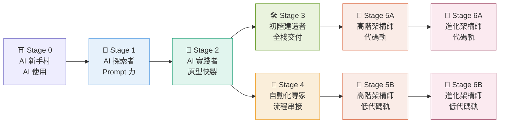
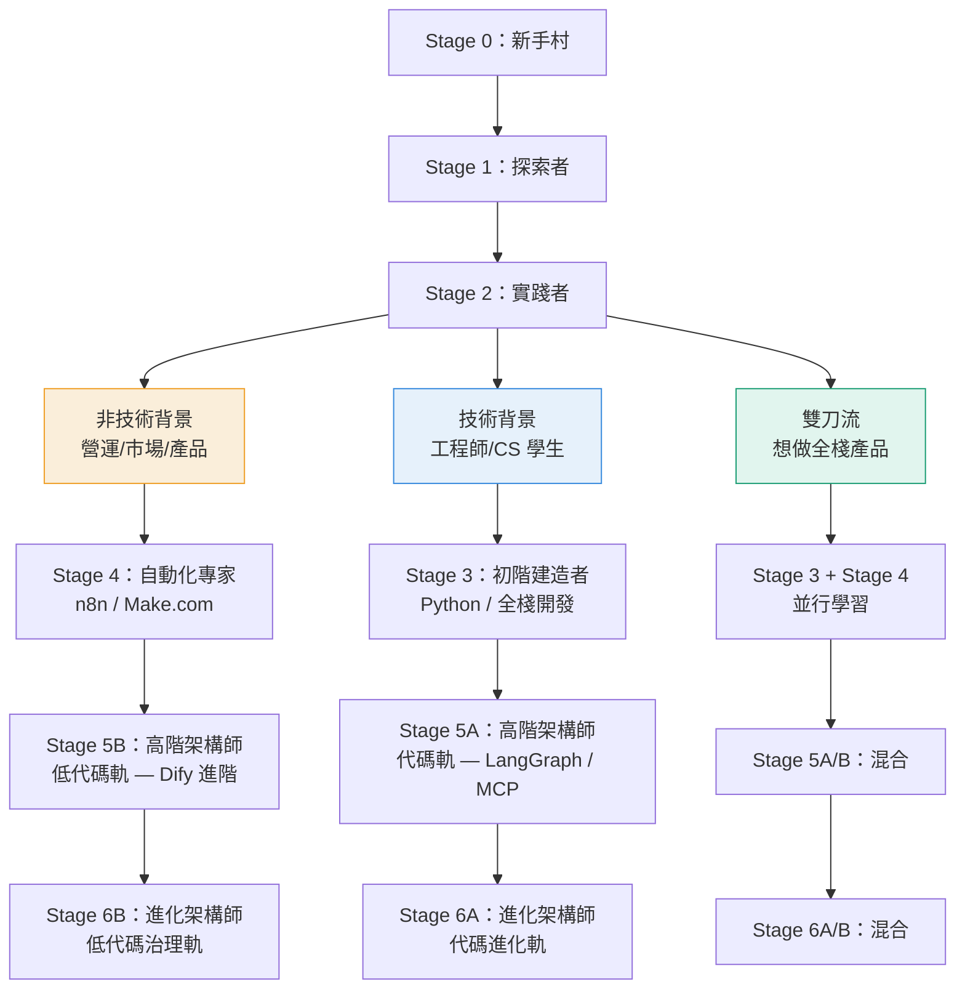

# 🏆 AI Lab 成長等級制度 — 7 階段造物者藍圖

> **核心理念**：每個人都是從零開始的造物者。這套等級制度不是貼標籤，而是幫你在每個階段看清「我現在在哪」「下一步是什麼」「怎麼證明我到了」。
>
> **📖 如何使用**：點擊下方各 Stage 連結進入詳細手冊，內含完整知識點、練習項目、通過標準與學習資源。

---

## 📋 7 階段總覽

| Stage | 等級名稱 | 一句話定義 | 對應 Roadmap Phase | 詳細手冊 |
|---|---|---|---|---|
| **0** | AI 新手村 (AI Novice) | 消除恐懼，建立人機協作思維 | Phase 0 | [📖 完整手冊](./stages/stage-0-ai-novice.md) |
| **1** | AI 探索者 (AI Explorer) | 把 LLM 用成頂級特助 | Phase 1 | [📖 完整手冊](./stages/stage-1-ai-explorer.md) |
| **2** | AI 實踐者 (AI Implementer) | 用 AI 快速做出能看的原型 | Phase 2 | [📖 完整手冊](./stages/stage-2-ai-implementer.md) |
| **3** | 初階 AI 建造者 (Junior AI Builder) | 交付能存檔、能運作的真實系統 | Phase 3 | [📖 完整手冊](./stages/stage-3-junior-builder.md) |
| **4** | 流程自動化專家 (Workflow Specialist) | 消除碎片化，打造全自動流程 | Phase 4 | [📖 完整手冊](./stages/stage-4-workflow-specialist.md) |
| **5** | 高階 AI 架構師 (Senior AI Builder) | 打造能自主決策的 Agent 系統 (分代碼軌與低代碼軌) | Phase 5 | [📖 完整手冊](./stages/stage-5-senior-builder.md) |
| **6** | 自我進化 Agent 架構師 (Evolution Architect) | 設計能自我改進的元 Agent (分代碼軌與低代碼軌) | Phase 6 | [📖 完整手冊](./stages/stage-6-evolution-architect.md) |

---

## ⛩️ Stage 0：AI 新手村 (AI Novice)

**一句話**：消除恐懼，建立人機協作思維。

**通過標準**：100% 參與第一週共學，並能流暢地與 AI 進行日常提問。

→ [📖 查看完整 Stage 0 手冊](./stages/stage-0-ai-novice.md)

---

## 🧭 Stage 1：AI 探索者 (AI Explorer)

**一句話**：掌握提示詞精髓，把 LLM 用成 24 小時無休的頂級特助。

**通過標準**：產出 1 篇能被社群公用的「結構化高級 Prompt 範本」，用來解決一個真實的辦公痛點。

→ [📖 查看完整 Stage 1 手冊](./stages/stage-1-ai-explorer.md)

---

## 🎨 Stage 2：AI 實踐者 (AI Implementer)

**一句話**：進入 Vibe Coding 領域，用直覺與 AI 協作，快速做出產品原型（MVP）。

**通過標準**：獨立產出 1 個具備基本互動、外觀完整的產品原型。

→ [📖 查看完整 Stage 2 手冊](./stages/stage-2-ai-implementer.md)

---

## 🛠️ Stage 3：初階 AI 建造者 (Junior AI Builder)

**一句話**：打通應用任督二脈，讓產品不再只是 Demo，而是能存檔、能運作的真實系統。

**通過標準**：成功建構 2 個完整實戰專案（前端 + 後端 + Database + 成功部署）。

→ [📖 查看完整 Stage 3 手冊](./stages/stage-3-junior-builder.md)

---

## 🔗 Stage 4：流程自動化專家 (Workflow Specialist)

**一句話**：打破軟體孤島，將企業碎片化工具串聯成「免人工干預」的完全自動化流程。

**通過標準**：獨立交付 2 個針對真實企業痛點的端到端自動化流程。

→ [📖 查看完整 Stage 4 手冊](./stages/stage-4-workflow-specialist.md)

---

## 🧠 Stage 5：高階 AI 架構師 (Senior AI Builder)

**一句話**：打造具備自主思考、決策、調用工具、擁有企業記憶（RAG）的 AI Agent 系統。

**通過標準**：為企業成功設計、測試並實際上線 1 套客製化的多智能體協作系統。

→ [📖 查看完整 Stage 5 手冊](./stages/stage-5-senior-builder.md)

---

## 🧬 Stage 6：自我進化 Agent 架構師 (Evolution Architect) 🆕

**一句話**：設計「能設計 Agent 的 Agent」— 打造具備自我反思、自我評估、自我改進能力的元 Agent 系統。

**通過標準**（擇一）：讓 Agent 在 100 次迭代中自行將成功率提升至 85%+ / 設計 Meta-Agent 自動生成專用 Agent / 用 DSPy 在 Benchmark 上提升 20%+。

→ [📖 查看完整 Stage 6 手冊](./stages/stage-6-evolution-architect.md)

---

## 🔀 等級路徑圖：你該走哪條路？

不同背景的人有不同的最優路徑：

| 背景 | 推薦路徑 | 理由 |
|---|---|---|
| **非技術背景**（營運/市場/產品） | 0→1→2→4→5B→6B | 專注低代碼與企業級流程整合，無需手寫代碼，安全降落 |
| **技術背景**（工程師/CS 學生） | 0→1→2→3→5A→6A | 直接深入代碼與 LLM 底層機制，解鎖定製化開發 |
| **雙刀流**（想做全棧產品） | 0→1→2→3+4→5A/B→6A/B | 左右開弓，兼顧開發靈活性與整合速度 |

---

## 📐 等級與學習路線圖對照表

| AI Lab 等級 | 對應 Roadmap Phase(s) | 核心學習內容 |
|---|---|---|
| Stage 0 | Phase 0 | LLM 基礎、Token、Context Window |
| Stage 1 | Phase 1 | Prompt Engineering、Function Calling、Agent 核心循環 |
| Stage 2 | Phase 2 | Vibe Coding（v0/bolt.new/Cursor）、Coze/Dify 低代碼 |
| Stage 3 | Phase 3 | LangChain、自定義 Tool、ReAct、全棧部署 |
| Stage 4 | Phase 4 | n8n/Make.com、Webhook、跨平台串接、錯誤處理 |
| Stage 5 | Phase 5 | **A軌(代碼)**: RAG、LangGraph、MCP Server、Docker / **B軌(低代碼)**: Dify進階、連接器 |
| Stage 6 | Phase 6 | **A軌(代碼)**: DSPy、Reflexion、GRPO/DPO 微調 / **B軌(低代碼)**: 自動化評估、Meta-Workflow |

> 📖 **學習路線圖完整內容** → 見 [AI-Agent-學習路線圖.md](./AI-Agent-學習路線圖.md)

---

## 🎯 快速定位：我在哪個等級？

| 問題 | 如果答案是「是」→ 你的等級至少是... |
|---|---|
| 你用過 ChatGPT/Claude 並知道怎麼問出好答案嗎？ | Stage 1 |
| 你用 v0/bolt.new 做過一個能交互的網頁嗎？ | Stage 2 |
| 你用 Python 寫過 API 並部署到雲端嗎？ | Stage 3 |
| 你搭建過跨多個 SaaS 工具的自動化流程嗎？ | Stage 4 |
| 你設計過一個包含 RAG + Memory 的 Agent 系統嗎？ | Stage 5 |
| 你寫過一個能根據評估結果自動改進自己的 Agent 嗎？ | Stage 6 |

---

## 🤝 梯隊互助機制

這套等級制度最大的價值不是排名，而是「高等級帶低等級」的互助生態：

| 你的等級 | 你可以... |
|---|---|
| Stage 5-6 | 擔任 Stage 0-3 學員的 Mentor，帶領實戰項目 |
| Stage 3-4 | 帶領 Stage 0-2 的工作坊，分享踩坑經驗 |
| Stage 1-2 | 幫助 Stage 0 的新手克服對 AI 的恐懼 |
| 所有人 | 在社群中分享你的等級晉升經驗，幫助後來者少走彎路 |

---

> **最後**：等級不是目的，能力才是。這套制度的本質是讓你知道「下一步該往哪走」和「怎麼證明自己到了」。
>
> 點擊上方各 Stage 的「完整手冊」連結，開始你的成長之旅。真正的成長不在於你掛上了哪個等級的標籤，而在於你幫助了多少人一起前進。
