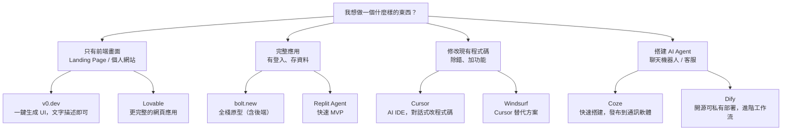
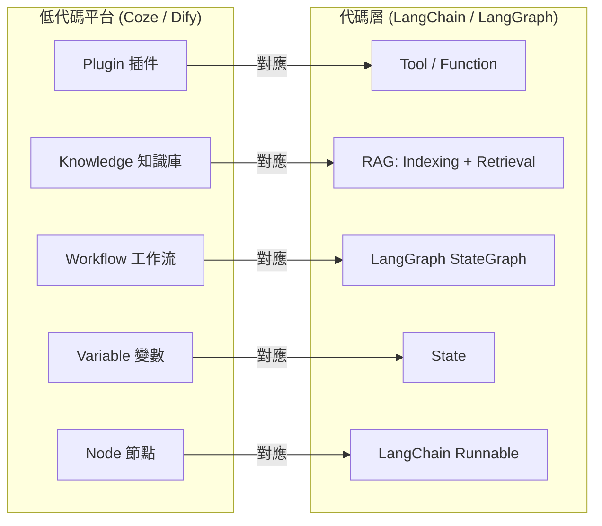

# 🎨 Stage 2：AI 實踐者 (AI Implementer)

> **一句話定義**：進入 Vibe Coding 領域！擺脫傳統語法死背，用直覺與 AI 協作，快速做出看得見、動得起來的產品原型（MVP）。

---

## 🎯 等級定位

| 維度 | 內容 |
|---|---|
| **階段定位** | 從「AI 使用者」到「AI 建造者」的橋樑——第一次讓想法變成螢幕上的東西 |
| **上一階段** | [Stage 1：AI 探索者](./stage-1-ai-explorer.md) |
| **下一階段** | [Stage 3：初階 AI 建造者](./stage-3-junior-builder.md) |
| **對應 Roadmap** | [Phase 2：低代碼實戰](../AI-Agent-學習路線圖.md#phase-2低代碼實戰--先做出來再理解2-周) |
| **建議學習時間** | 2 週（衝刺型）/ 3-4 週（穩健型） |

### 你在這個階段的畫像

- 你已經熟練使用 AI 進行對話和內容生成
- 你可能有一個產品點子，但「不會寫程式」卡住了你
- 或者你會寫一點程式，但覺得從零開始太慢
- **這個階段的目標**：用 AI 輔助，在幾小時內做出一個能交互的原型

---

## 📐 前置條件

- ✅ 已完成 [Stage 1](./stage-1-ai-explorer.md)
- ✅ 能寫出結構化 Prompt
- ✅ 理解 Function Calling 的基本概念
- ✅ 對「前後端」、「API」、「資料庫」有最基礎的認知（不需要會寫）

---

## 🧠 知識點清單

### 1. Vibe Coding 核心概念

> **什麼是 Vibe Coding？**
> 不是「讓 AI 幫你寫程式」，而是「用自然語言描述你想要什麼，AI 負責實現」。你描述「感覺」和「功能」，AI 處理「語法」和「實現」。

| 傳統開發 | Vibe Coding |
|---|---|
| 學語法 → 學框架 → 看文件 → 寫程式 | 描述需求 → AI 生成 → 微調 → 發布 |
| 從語法開始 | 從想法開始 |
| 幾週做出原型 | 幾小時做出原型 |

**Vibe Coding 的核心心法**：
1. **先有畫面再寫 Prompt**：先想清楚「我要什麼樣的畫面/互動」，再描述給 AI
2. **小步快跑**：每次只改一個功能，確認 OK 後再改下一個
3. **學會讀程式碼（不是寫）**：能看懂 AI 生成的程式碼大致的邏輯就夠了
4. **版本控制是救命繩**：每次大改前先存一版，出事可以回頭

### 2. Vibe Coding 工具矩陣

| 工具 | 類型 | 一句話 | 適合場景 |
|---|---|---|---|
| **v0.dev** | 零代碼 | 用文字描述，直接生成網頁 UI | 快速原型、Landing Page |
| **bolt.new** | 零代碼 | 在瀏覽器中生成完整應用（含後端） | 全棧原型、小型工具 |
| **Cursor** | AI IDE | 在編輯器中用自然語言改程式碼 | 修改現有專案、除錯 |
| **Windsurf** | AI IDE | Cursor 的替代選擇 | 同樣是 AI 輔助開發 |
| **Lovable** | 零代碼 | 像 v0 但生成的程式碼更完整 | 完整前端應用 |
| **Replit Agent** | 零代碼 | 在 Replit 中直接生成全棧應用 | 快速上線 MVP |



### 3. 基礎網頁概念（不用精通，但要認識）

| 概念 | 一句話解釋 |
|---|---|
| **HTML** | 網頁的骨架（標題、段落、按鈕在哪裡） |
| **CSS** | 網頁的化妝（顏色、字體、排版） |
| **JavaScript** | 網頁的動作（點擊後發生什麼事） |
| **前端 (Frontend)** | 使用者看到的畫面 |
| **後端 (Backend)** | 在伺服器上處理資料的邏輯 |
| **API** | 前端和後端之間的溝通方式 |
| **資料庫 (Database)** | 存資料的地方（用戶帳號、文章內容等） |
| **部署 (Deploy)** | 把網站放到網路上讓別人能訪問 |

### 4. Coze / Dify 低代碼 Agent 平台

> 這是 Vibe Coding 和 Agent 開發的交集——你可以在不寫程式碼的情況下搭建 Agent。

| 平台 | 定位 | 一句話 |
|---|---|---|
| **Coze (扣子)** | 字節跳動出品 | 插件生態豐富，快速發布到飛書/微信 |
| **Dify** | 開源可私有部署 | 企業級 Workflow，支援複雜邏輯 |

**低代碼 ↔ 代碼概念對照**：

| 低代碼概念 | 對應代碼層概念 |
|---|---|
| Plugin（插件） | Tool / Function |
| Knowledge（知識庫） | RAG 的 Indexing + Retrieval |
| Workflow（工作流） | LangGraph StateGraph |
| Variable（變數） | State |
| Node（節點） | LangChain Runnable |



---

## 🛠️ 技能要求

### 硬技能

| 技能 | 說明 | 熟練度目標 |
|---|---|---|
| v0.dev / bolt.new | 用文字生成網頁原型 | 熟練 |
| AI IDE 使用 | Cursor / Windsurf 的基本操作 | 掌握 |
| HTML/CSS 閱讀 | 能看懂 AI 生成的程式碼並做小修改 | 入門 |
| Git 基礎 | init / add / commit / push | 入門 |
| 部署基礎 | 知道怎麼把網頁放到 Vercel/Netlify | 入門 |
| Coze/Dify | 能搭建簡單的 Agent Workflow | 掌握 |

### 軟技能

- **產品感知**：能從使用者角度想「這個功能有沒有用」
- **迭代心態**：接受第一版不完美，快速改進
- **Prompt 進化**：從「幫我寫」進化到「幫我做」

### 推薦工具

| 工具 | 用途 | 費用 |
|---|---|---|
| [v0.dev](https://v0.dev/) | 快速生成 UI 原型 | 免費/付費 |
| [bolt.new](https://bolt.new/) | 全棧原型生成 | 免費/付費 |
| [Cursor](https://cursor.sh/) | AI 驅動程式編輯器 | 免費/付費 |
| [Coze](https://www.coze.com/) | 低代碼 Agent 搭建 | 免費 |
| [Dify](https://dify.ai/) | 開源 Agent 平台 | 免費/付費 |
| [Vercel](https://vercel.com/) | 前端部署 | 免費/付費 |
| [GitHub](https://github.com/) | 版本控制 | 免費 |

---

## 💪 練習項目

### 練習 1：第一個 Vibe Coding 作品（2 小時）

**目標**：用 v0.dev 生成一個個人名片頁面。

```
Prompt 範例：
「請幫我設計一個個人名片網頁，包含以下元素：
1. 我的名字：[你的名字]
2. 職位：[你的職位]
3. 一段自我介紹（約 100 字）
4. 聯絡方式：Email、GitHub、LinkedIn
5. 風格：簡約現代的設計，使用柔和的漸層背景色」

生成後：
- 修改文字內容
- 調整顏色
- 嘗試加入一個新區塊（如：技能列表）
```

### 練習 2：Coze Agent 搭建（3 小時）

**目標**：在 Coze 上搭建一個「AI 日報生成器」。

```
功能設計：
- 輸入：使用者感興趣的主題（如「AI」、「加密貨幣」）
- 工具：搜尋插件 + 大模型
- 工作流：搜尋最新資訊 → 篩選重要內容 → 生成結構化日報
- 輸出：格式化的 Markdown 日報（含標題、摘要、連結）

加分項：發布到飛書 Bot，每天早上自動推送。
```

### 練習 3：Dify 智能客服（4 小時）

**目標**：用 Dify 搭建一個具備知識庫的客服 Agent。

```
功能設計：
- 知識庫：上傳 3-5 份產品說明文件
- 工作流：意圖識別 → 知識檢索 → 答案生成
- 轉人工：無法回答時自動記錄並轉接
- 變數：記錄對話歷史，支援追問
```

### 練習 4：bolt.new 全棧原型（3 小時）

**目標**：生成一個簡單的待辦事項（Todo）應用。

```
Prompt 範例：
「請幫我做一個待辦事項應用：
1. 可以新增、編輯、刪除待辦事項
2. 可以標記完成/未完成
3. 資料要保存（重新整理不會消失）
4. 介面乾淨美觀
5. 使用 React + localStorage」

生成後嘗試：修改介面、加入分類功能、加入截止日期
```

### 練習 5：Stage 3 入門準備 — 技術地基搭建（3 小時）🆕

> **為什麼需要這個練習**：Stage 3 要求你具備全棧開發能力（前端+後端+DB+部署）。如果你直接從 Vibe Coding 跳進去，會感到巨大的技術落差。這個練習幫你在進入 Stage 3 前，把必備的「技術地基」先打好。

**目標**：在進入 Stage 3 之前，確保你能獨立完成以下 5 件事。不需要精通，只要「跑得通」。

**五步地基檢查**（做完一項勾一項）：

- [ ] **步驟 1：Python 環境就緒（30 分鐘）**
  - 下載安裝 Python 3.10+（[python.org](https://www.python.org/)）
  - 打開終端機（Windows: PowerShell / Mac: Terminal），輸入 `python --version` 確認版本
  - 安裝 VS Code 或 Cursor，建立第一個 `.py` 檔案，寫 `print("Hello AI Lab")` 並執行成功

- [ ] **步驟 2：理解 API 的實際運作（30 分鐘）**
  - 用瀏覽器打開這個網址：`https://api.github.com/users/KeithHello`
  - 你會看到一堆 JSON 文字——這就是 API 的回應
  - 用 AI 輔助寫一個 10 行的 Python 腳本，呼叫這個 API 並印出 `name` 和 `public_repos` 兩個欄位
  - 執行腳本，確認你能「從程式碼中獲取外部資料」

- [ ] **步驟 3：理解前端如何呼叫後端（30 分鐘）**
  - 用 AI（Cursor/Claude）生成一個最簡的 HTML 頁面（`index.html`）
  - 頁面只有一個按鈕：「點我取得 GitHub 用戶資料」
  - 點擊後，JavaScript 呼叫步驟 2 的同一個 API，把 `name` 顯示在頁面上
  - 用瀏覽器打開這個 `index.html`，確認按鈕可以運作
  - **核心理解**：前端（HTML/JS）→ 呼叫 API → 獲取資料 → 顯示給使用者

- [ ] **步驟 4：Git 基礎操作（30 分鐘）**
  - 安裝 Git（[git-scm.com](https://git-scm.com/)）
  - 在終端機中依序執行以下指令（理解每步在做什麼）：
    ```
    git init                          # 初始化一個 Git 倉庫
    git add .                         # 把所有檔案加入追蹤
    git commit -m "我的第一個 commit"   # 建立一個版本快照
    ```
  - 註冊 GitHub 帳號，創建一個新倉庫
  - 把本地倉庫 push 到 GitHub（用 AI 輔助完成）

- [ ] **步驟 5：理解資料庫的概念（30 分鐘）**
  - 用 AI 解釋：「什麼是資料庫？為什麼網頁應用需要它？」
  - 註冊 Supabase 免費帳號（[supabase.com](https://supabase.com/)）
  - 在 Supabase 中建立一個「test」表格，手動加入 2 筆資料
  - 用 Supabase 提供的 API URL 在瀏覽器中查詢這些資料（類似步驟 2）

**通過標準**：5 個步驟全部完成。如果你卡在任何一步超過 30 分鐘，用 AI 輔助排查——這本身就是 Stage 3 的重要技能。

---

## 🏅 通過標準

**硬性指標**：

- [ ] 運用 Vibe Coding 工具，獨立產出 **1 個**具備基本互動、外觀完整的產品原型
- [ ] 成品必須包含：多個頁面或區塊 + 使用者互動（點擊/輸入） + 基本的美觀設計
- [ ] 在 Coze 或 Dify 上搭建 1 個完整可運行的 Agent Bot
- [ ] 完成「練習 5：Stage 3 入門準備」全部 5 個步驟（Python環境/API理解/前端後端/Git/資料庫概念）
- [ ] 完成 1 份「Vibe Coding 實戰筆記」（記錄用了哪些工具、遇到什麼坑、學到什麼）

**軟性指標**：

- [ ] 能獨立判斷一個點子是否適合用 Vibe Coding 實現
- [ ] 看到一個網頁時，能大致理解「AI 大概用了什麼方式生成這部分」
- [ ] 知道何時該用零代碼工具（v0/bolt），何時該用 AI IDE（Cursor）

---

## 🔝 升階條件

**進入 Stage 3 前，你應該能回答以下問題**：

1. v0.dev 和 bolt.new 有什麼區別？各自適合什麼場景？
2. 當 AI 生成的網頁有 bug 時，你會怎麼修？
3. Coze 的「工作流」和 Dify 的「工作流」有什麼共通點和差異？

**下一步有兩個選擇**：

| 路線 | 下一階段 | 說明 |
|---|---|---|
| **技術路線** | [Stage 3：初階 AI 建造者](./stage-3-junior-builder.md) | 深入程式碼層，學習真正的全棧開發 |
| **自動化路線** | [Stage 4：流程自動化專家](./stage-4-workflow-specialist.md) | 繼續用低代碼思維，但做更複雜的企業流程 |

---

## 📚 學習資源

### 免費資源

| 資源 | 簡介 | 連結 |
|---|---|---|
| 魚皮 Vibe Coding 教程 | 最完整的中文 Vibe Coding 零基礎教程 | [ai-guide](https://github.com/liyupi/ai-guide) |
| v0.dev 官方文件 | Vercel 出品，學習如何用好 v0 | [v0.dev](https://v0.dev/) |
| Cursor 官方文檔 | AI IDE 的完整使用指南 | [cursor.sh](https://docs.cursor.sh/) |
| Coze 官方教學 | 扣子平台的官方使用手冊 | [coze.com](https://www.coze.com/) |
| Dify 文檔 | 開源 Agent 平台的完整指南 | [dify.ai](https://docs.dify.ai/) |

### 推薦 YouTube

- **程式員魚皮**：Vibe Coding 實戰教學
- **Fireship**：快速了解各種新工具（英文）
- **Web Dev Simplified**：基礎網頁概念（英文）

---

> **給 Stage 2 的你**：這是整個路線圖中最「有成就感」的階段——你會第一次看到自己的點子變成螢幕上能動的東西。享受這個過程，別急著追求完美。做出來的東西看起來很爛？沒關係，下一個會更好。
>
> **下一步**：[進入 Stage 3：初階 AI 建造者](./stage-3-junior-builder.md) 或 [Stage 4：流程自動化專家](./stage-4-workflow-specialist.md)
